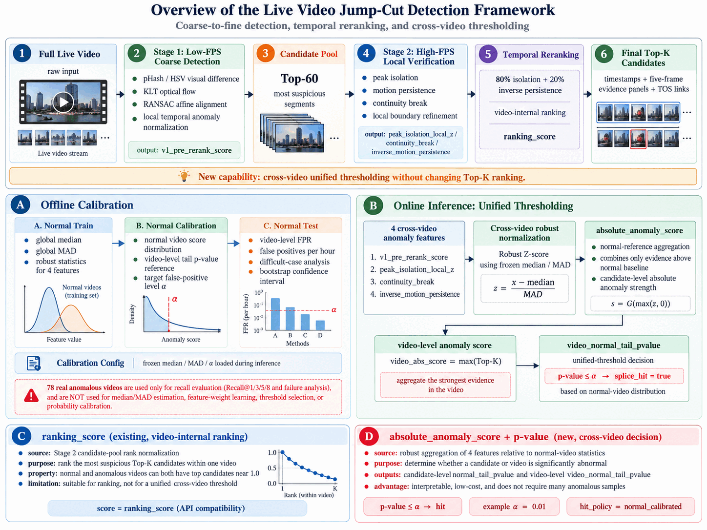

# Video Frame Quality & Multimodal Retrieval

[](https://github.com/jingsiihu-ai/video-frame-quality-retrieval/actions/workflows/tests.yml)
[](https://www.python.org/)
[](LICENSE)

A clean-room reference pipeline for selecting useful video frames with image-quality signals, temporal anomaly detection, multimodal embeddings, and diversity-aware retrieval.

The repository turns a practical video-understanding problem into small, testable components. It is model-agnostic: callers can supply embeddings from CLIP or another vision-language encoder, OCR text, and ASR segments without coupling the ranking logic to a particular inference stack.

## Pipeline

<p align="center">
  
</p>

## What is included

- deterministic uniform sampling for bounded inference budgets;
- brightness, contrast, and Laplacian sharpness scores;
- local-isolation and neighborhood-persistence temporal signals;
- normalized fusion of visual, OCR, and ASR embeddings;
- query relevance, quality-aware candidate scoring, and MMR reranking;
- a synthetic video demo, unit tests, CI, and method documentation.

## Quick start

```bash
python -m venv .venv
source .venv/bin/activate
pip install -e .
python examples/synthetic_demo.py
pytest
```

The demo constructs a synthetic three-scene video, injects visual outliers and degraded frames, then retrieves a compact, diverse set for a target query.

Expected output:

```text
selected frames: [36, 4, 35, 38, 42, 37]
scene IDs: [2, 0, 2, 2, 2, 2]
utilities: [0.845, 0.628, 0.842, 0.843, 0.843, 0.842]
```

## Minimal usage

```python
from video_frame_retrieval import rank_frames, two_stage_temporal_scores

anomaly = two_stage_temporal_scores(frame_embeddings)
selected = rank_frames(
    frame_embeddings,
    query_embedding,
    quality_scores,
    anomaly_scores=anomaly,
    k=8,
)
```

## Public-release boundary

This is an independent implementation using generic algorithms and synthetic inputs. It contains no employer code, datasets, media, model endpoints, internal parameter values, or confidential evaluation results. The defaults are illustrative and should be tuned only on a documented public validation set.

See [docs/method.md](docs/method.md) for equations, extension points, and references.
See [results.md](results.md) for reproducible demo and CPU benchmark results.
